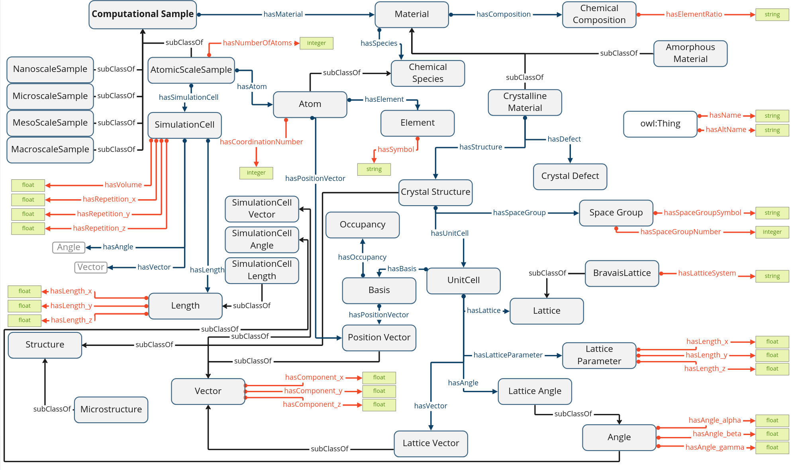

# Computational Material Sample Ontology (CMSO)
CMSO is an ontology that aims to describe computational materials science samples (or structures), including crystalline defects. Initially focusing on the description at the atomic scale.

This project is in the initial phase of development. 

## Acknowledgements

This work is supported by the [NFDI-Matwerk](https://nfdi-matwerk.de/) consortia.(Deutsche Forschungsgemeinschaft (DFG) - Projektnummer 460247524)
