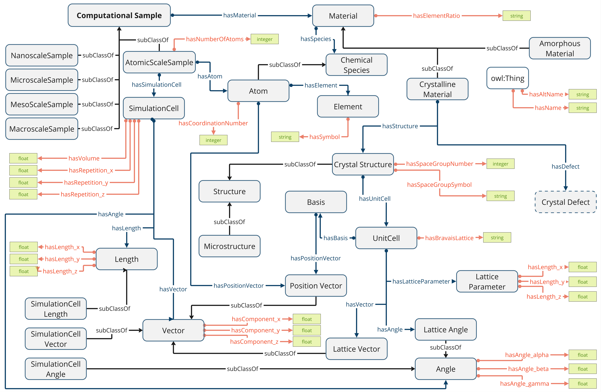

# Computational Material Sample Ontology (CMSO)
CMSO is an ontology that aims to describe computational materials science samples (or structures), including crystalline defects. Initially focusing on the description at the atomic scale.

### Documentation
[https://ocdo.github.io/cmso-ontology/](https://ocdo.github.io/cmso-ontology/)

This project is in the initial phase of development. 

### Contributing
- Proposing new terms or changes to be included in the ontology can be suggested raising an issue.
- Meeting dates can be found [here](https://github.com/Materials-Data-Science-and-Informatics/cmso-ontology/wiki)
- Contact: [a.azocar.guzman@fz-juelich.de](mailto:a.azocar.guzman@fz-juelich.de).

### Acknowledgement
This work is developed at the Materials Data Science and Informatics (IAS‑9), Forschungszentrum Jülich GmbH. Supported by the NFDI-MatWerk consortium (Funded by the Deutsche Forschungsgemeinschaft (DFG, German Research Foundation) under the National Research Data Infrastructure – NFDI 38/1 – project number 460247524"). 
